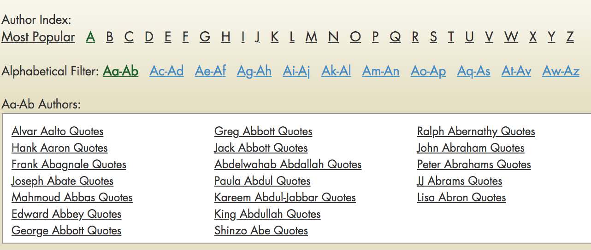

# Capstone Project: Predicting a Quote's Author

My project topic was inspired by a desire to learn more about Natural Language Processing (NLP).  My goal was to use both supervised and unsupervised machine learning models to explore a collection of quotes that are from a diverse group of people (politicians and political leaders, musicians, poets, playwrites, authors, scientists, business people, actors, artists, activists, athletes and philosophers) and address two problem statements.
* **Problem Statement 1**: Given a collection of quotes, can the author of the quote be identified based on content and style.
* **Problem Statement 2**: Given a random collection of quotes can a set of common topics/themes be identified.
 

The original data source for the project is the [Successories web collection of most popular quotes].  Quotes were obtained for all authors from A to Z.  Extracted attributes were:
* author
* quote

## I. Repository Contents

* code
  * capstone-eda.ipynb
  * capstone-models.ipynb
  * capstone-started.ipynb
* datasets
  * authors.csv
  * bible.csv
  * bible_target.csv
  * mark_twain.csv
  * quotes.csv
  * scripture.csv
  * scripture_original_sw.csv
  * twain_target.csv
* gridsearch_results
  * gs_results.csv
* quote_data
  * a_quotes.csv, b_quotes.csv, c_quotes.csv, d_quotes.csv, e_quotes.csv
    f_quotes.csv, g_quotes.csv, h_quotes.csv, iq_quotes.csv, j_quotes.csv,
    k_quotes.csv, l_quotes.csv, m_quotes.csv, n_quotes.csv, o_quotes.csv,
    p_quotes.csv, r_quotes.csv, s_quotes.csv, t_quotes.csv, uv_quotes.csv, 
    w_quotes.csv, xyz_quotes.csv 

#### Code
Project code is broken out into three jupyter notebooks that can be found in the _code_ directory.  Each notebook focuses on a specific goal or set of goals which is outlined below. 

* **capstone-started.ipynb**: The notebook extracts/scrapes data from the web site and persists the observations to csv files under the _quote_data_ directory.
* **capstone-eda.ipynb**: The notebook reviews the quote collection and ultimately creates two collections for prediction modeling 1) Top 10 Authors (to help reduce classification) and 2) Scriptures.  All quotes are transformed  - cleaned of stopwords, lemmatized and then stemmed.  Each stage is a feature in a dataframe that is then written to a csv file and used in the modeling phase.
* **capstone-modeling.ipynb**: The notebook, through pipelines and gridsearchCV tests various supervised models (MultinomialNB, Logistic Regression and RandomForestClassifier) on the Top10 Authors and Scripture datasets.  Unsupervised learning is also performed with gensim’s LDA (Latent Dirichlet Allocation) model.

#### Datasets
The _datasets_ directory contains the feature engineered datasets that are used by modeling notebook.
* **authors.csv**: Quote data for top 10 authors, fields include the author, original quote along with the text in its various stages of transformation, no_stopwords, lemmatized and finally stemmed.
* **bible.csv**: Quick check of about 12 Bible quotes to test with supervised models.
* **bible_target.csv**: Quote data for the Bible quick check. Fields include the author (i.e source) and the original quote along with the text in its various stages of transformation, no_stopwords, lemmatized and finally stemmed.
* **mark_twain.csv**:   Quick check of about 10  quotes to test with supervised models.
* **twain_target.csv**: Quote data for the Mark Twain quick check. Fields include the author (i.e source) and the original quote along with the text in its various stages of transformation, no_stopwords, lemmatized and finally stemmed.
* **quote.csv**:   All quotes - Fields include author (i.e source) and the original quote along with the text in its various stages of transformation, no_stopwords, lemmatized and finally stemmed.
* **scripture.csv**: Quote data for Scripture (Bible, Quran Granth Sahib), generated with an nltk enhanced stopword list that included [unto, ye, thee ]. Fields include the author (i.e source) and the original quote along with the text in its various stages of transformation, no_stopwords, lemmatized and finally stemmed.
* **scripture_original_sw.csv**: Another Scripture dataset, this time generated with the original nltk stopword list. Fields include the author (i.e source) and the original quote along with the text in its various stages of transformation, no_stopwords, lemmatized and finally stemmed.

#### Gridsearch Results
The _gridsearch_results_ directory includes results from the various gridsearchCVs run over various pipeline. To help with the supervised modeling process, I began writing estimator details to a dataframe and then to a .csv file so that I would have a history of performance (accuracy scores) for the different parameters.  This is mostly an internal dataset for my benefit so I will not provided more details at this time.

* **gs_results.csv**: File containing score and parameter details for the numerous gribsearchCVs are the varous models and datasets.

#### Quote Data
The _quote_data_ directory includes the original dataset resulting from the scrape of the Successories web site.  There is more or less a _.csv_ file for each letter in the alphabet.  The scraping process included multiple GET requests and could be somewhat time expensive. To help reduce any potential issues (timeouts or otherwise) and minimize any data loss that might occur as a result, the scraping process was broken down into alphabetic batches.  In some cases, if the number of authors for a given letter was small, letters could be combined into one batch (ex. the letters i and q). 

## II. Gathering Data: Web Scraping

The Successories quote site is alphabetic and somewhat deeply nested; however, data will only need to be scraped once as the content is relatively static. The process of extracting all authors quotes is iterative and will include multiple GET request to the site.  To minimize any impact there is a delay of .5 seconds before each request is submitted. 

The steps for extraction are... iterate through each letter's (A-Z) url.  Each letter includes a list of alphabetized sub-urls (ex. _Aa-Ab_, _Ac-Ad_, _Ae-Af_ etc...).  Iterate through each letter's sub-urls and collect all of the authors urls within that page.  Once all of the author urls have been collected for the given letter, iterate through that list and collect the quotes for each author.  Note the each author’s quotes may be several pages deep so in many cases they will have to be iterated through as well. 

Note the extraction code was designed so that quotes could be extracted in batches of either one or more letters.  In most cases, one letter represents a batch.  Once extraction is completed for a given batch, the quote data is written to a _.csv_ file.

## III. Data and Data Transformation

#### The Data
Several steps were taken to prepare the scraped data for modeling.  First, the dataset included 6945 authors - a very large count for supervised classification modeling. Also, many of the authors had only a limited number of quotes - too few for effective modeling.  In order reduce the number of authors to a reasonable classification problem and also ensure that the authors had a sufficient number of quotes for modeling, data was group by author, his/her quotes were counted and then ordered in descending order.  I reviewed the top 15 authors and decided to exclude authors that were not individuals (i.e. Bible, Quran, Granth Sahib) or were 'Unknown' and then re-grouped and re-counted.  From there I selected the top 10 authors which gave me an all male list with each author having more than 300 quotes.  

**List of top 10 authors and their quote count**  
Ralph Waldo Emerson (888)   
Mark Twain (679)   
William Shakespeare (574)  
Oscar Wilde (509)  
Albert Einstein (485)  
George Bernard Shaw (402)  
Ambrose Gwinett Bierce (398)  
Henry David Thoreau (396)  
Friedrich Wilhelm Nietzsche (393)  
Scott McClellan (354)  
(**total of 5,078 quotes**)

I was also curious about the religious sources that were scraped so I decided to keep those as a separate dataset and attempt to model them as well. 

**Religious scriptures and their quote count**  
Bible (1139)  
Granth Sahib (574)  
Quran (486)  
(**total of 2,199 quotes**)

#### Data Transformation
Once the datasets were determined for supervised modeling, I transformed the quotes, first removing the stopwords and punctuation, then lemmatizing the resulting text for verbs, adjectives and nouns and finally stemming the result. Note the SnowballStemmer was used in place of the PorterStemmer; however, I did not see a significant difference in the resulting text. Each stage of the transformation was stored as part of the dataset’s dataframe which was then written to _.csv_ file. 

Note stopwords were done separately for each dataset.  All used the nltk stopswords as their base, but each supervised dataset had a few of their own additions.  For the top 10 authors, only ["n't"] was added.  For the scriptures, the following were added ["unto", "thee", "ye", "thy"].  For the unsupervised dataset that included all the quotes transformed, I used the basic stopwords and added ["n't", "unto", "thee", "ye", "thy"].  Looking back, I believe I could have used the same stopword list for all datasets, but initially I wanted the flexibility to try different lists on different datasets if needed.

## IV. Modeling

#### Supervised Learning 
Supervised learning was done for the both the top 10 authors and scripture datasets with the quote field as the feature source and the author field as the label.  Several different types of models were tested including MultinomialNB, LogisticRegression and RandomForestClassifiers.  Each model was setup in a pipeline that also included a vectorization stage (Either CountVectorizer or TfidfVectorizer was used to transform the feature text into a Bag of Words representation), and in some tests with LogisticRegression models a PCA (Principal Component Analysis) stage was also included.  The various pipelines were then each run through a GridSearchCV numerous times with various parameters being tested and changed. Note the GridSearchCV was fitted with a training set that was either 80% or 90% of the dataset and model accuracy was then scored with the remaining 20 or 10% test set. Given the datesets were small the test could not be any larger and all models performed better with 90%/10% split.   

#### Supervised Learning Results
With both datasets, the Naive Bayes model (MultinomialNB) was the best performer with  LogisticRegression not far behind.  The ensemble RandomForestClassifier did not perform well with either dataset.

**Scriptures**:
The baseline for the scripture dataset was .518 and the MultinomialNB model was able to achieve an accuracy score .945 using quote data with only stopwords removed and tokenized, counted and normalized with a TfidfVectorizer. The parameters for the vectorizer included lowercase=False, max_df=0.5, max_features=None and ngrams=(1,2).  Parameters for the classifier included an alpha=0.2 and a fit_prior=False.

**Top 10 Authors**:
The baseline for the top 10 dataset was just .175 and the MultinomialNB model was able to achieve an accuracy score .604 accuracy with the following parameters using quote data with only stopwords removed and tokenized, counted with a CountVectorizer. The parameters for the vectorizer included lowercase=True, max_df=0.5, min_df=1, max_feaures=None and ngrams=(1,2).  Parameters for the classifier included an alpha=0.2 and a fit_prior=True.

#### Unsupervised Learning
Given the large number of quotes (102,455) from a such a diverse group of people, it seemed like an interesting opportunity to attempt to identify some overall themes.  Topic modeling was performed using Gensim's Latent Dirichlet Allocation (LDA) model.  Initial attempts have not yet yielded results that reveal any structure to the collection, but modeling is still ongoing.  My first few attempts included modeling for a higher number of topic (20 or more) with a lower number of passes.  The higher number of topics is probably better if attempting to discover possible features within the document collection.  I since have reduced the number of topics to about 5 and increased the number of passes from 50 to 75 to see if that reveals more.

## V. Next Steps

#### Supervised Learning
Increase top 10 authors dataset and see if model performance can be improved
#### Unsupervised Learning
Continue with topic modeling.  

## VI. Extras
#### Description of Religious Scriptures

The **Bible** is a collection of sacred texts or scriptures that Jews and Christians  consider to be a product of divine inspiration and a record of the relationship between  God and humans.

The fundamental beliefs of Sikhism are articulated in the scripture Guru **Granth Sahib**, which focuses on meditation on the name of the one creator, divine unity and equality of all humankind, engaging in selfless service and striving for social justice for the benefit and prosperity of all.

The **Quran** is the central religious text of Islam, which Muslims believe to be a revelation from God (Allah). Muslims believe that the Quran was verbally revealed by God to Muhammad through the angel Gabriel (Jibril), gradually over a period of approximately 23 years.

[//]: # (These are reference links used in the body of this note and get stripped out when the markdown processor does its job. There is no need to format nicely because it shouldn't be seen. 

   [Successories web collection of most popular quotes]: https://www.successories.com/iquote/authors/most

